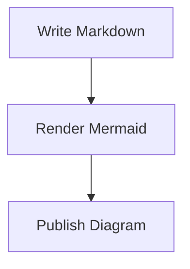
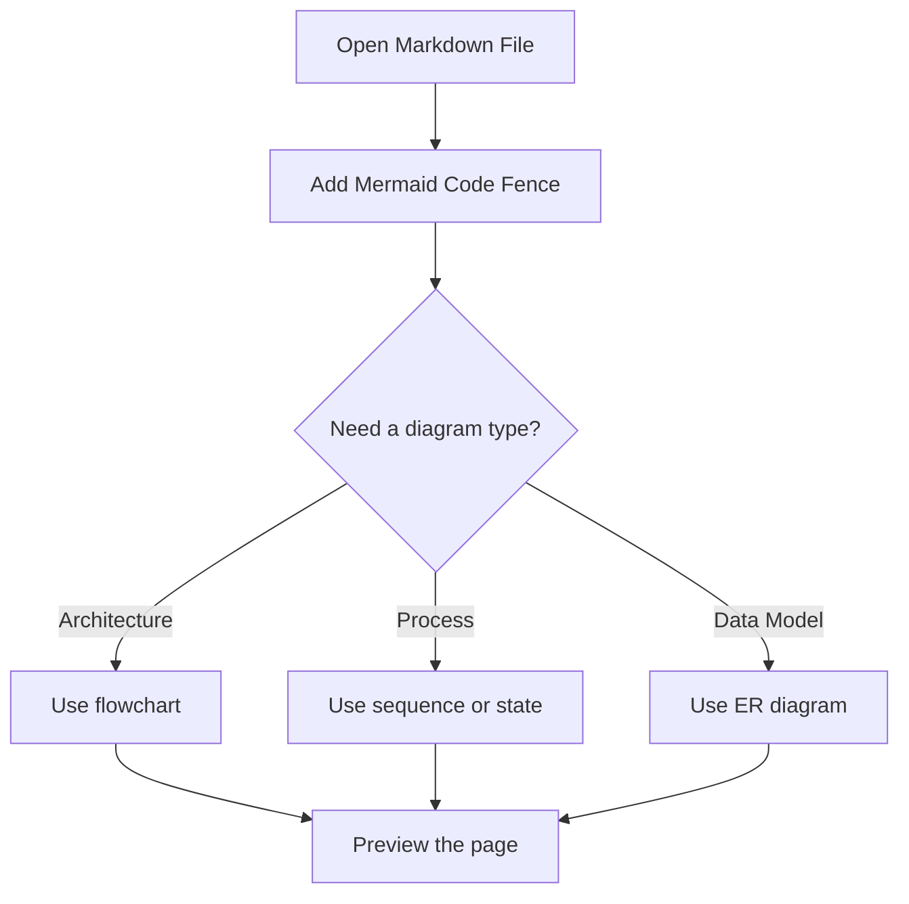
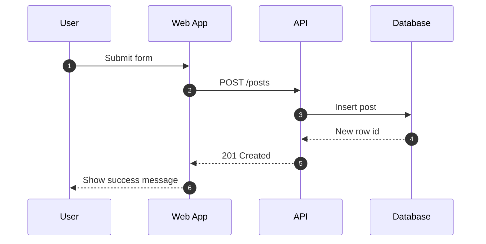
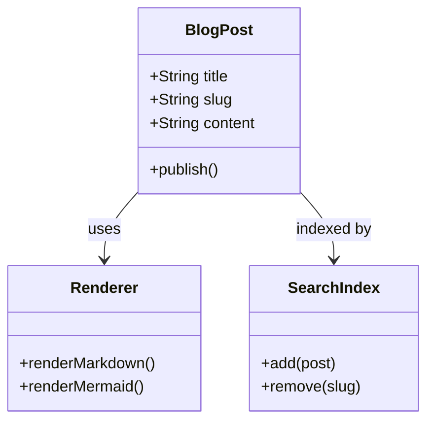
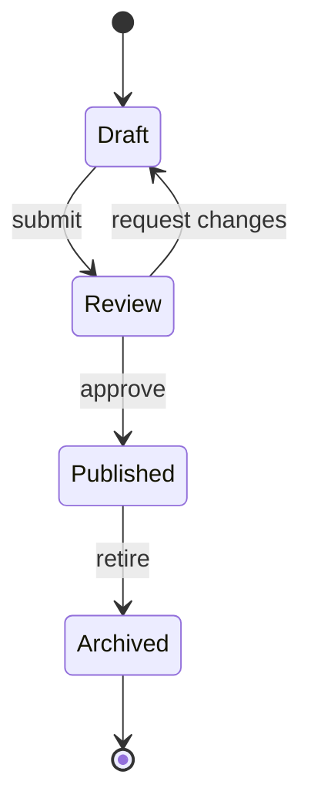
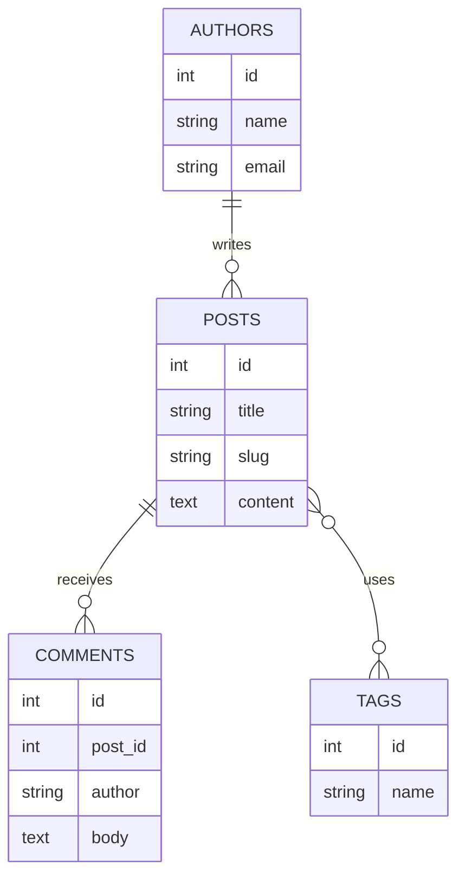
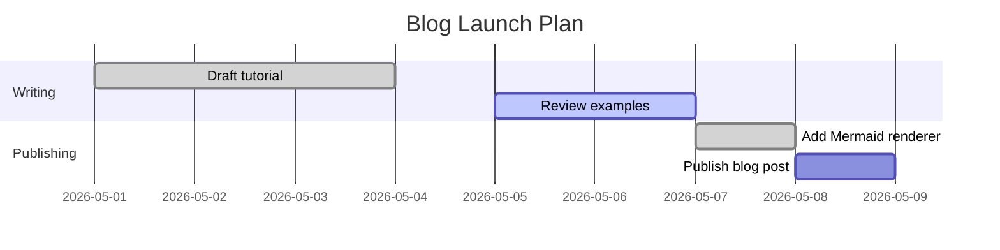
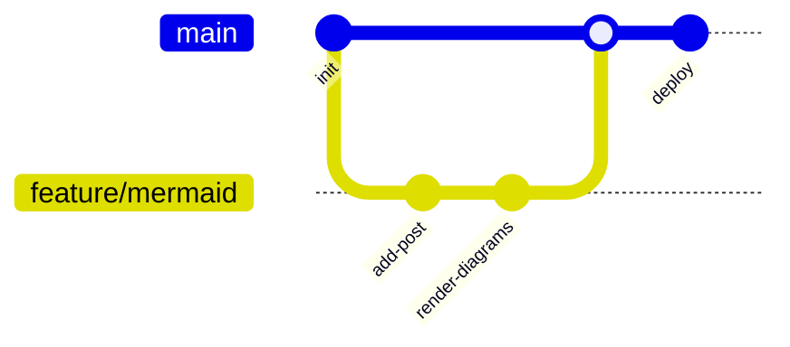
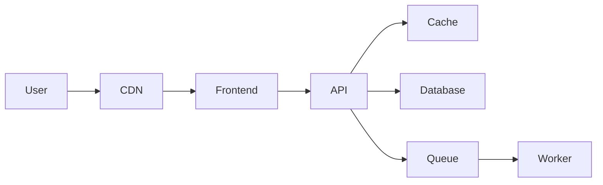

# How to Use Mermaid in Markdown for Diagrams Like PlantUML

Mermaid lets you write diagrams directly inside Markdown code fences. If you already use PlantUML, the idea feels familiar: write text, commit it with your docs, and let the renderer turn it into a diagram. The main difference is that Mermaid is usually easier to embed in README files, docs sites, and blog posts because the syntax lives inline inside regular Markdown.

## Why Mermaid Works Well in Markdown

When a project already uses Markdown for documentation, Mermaid keeps the diagram source close to the explanation. That makes reviews easier because the text and the diagram change together in one file.

Mermaid is a good fit when you want:

- diagrams stored next to your docs
- a syntax that works inside Markdown fences
- something lighter than exported images
- a faster authoring workflow for technical posts

PlantUML is still strong for very large or strict UML-heavy documentation, but Mermaid is usually simpler when your target is Markdown-first publishing.

## Basic Mermaid Syntax

The starting point is a fenced code block with the `mermaid` language tag:

````markdown

````

If your Markdown renderer supports Mermaid, that block becomes a live diagram.

## 1. Flowchart

Flowcharts are the easiest entry point and a good replacement for many simple PlantUML activity diagrams.



Use `TD` for top-down layout or `LR` for left-to-right.

## 2. Sequence Diagram

Sequence diagrams are useful when you want to explain requests moving across services, APIs, or jobs.



This is one of the clearest options for backend walkthroughs and integration documentation.

## 3. Class Diagram

If you want something closer to UML, Mermaid can also draw class diagrams.



This is where Mermaid starts to overlap more directly with PlantUML, although PlantUML still goes deeper for full UML modeling.

## 4. State Diagram

State diagrams are useful for workflows, job lifecycles, or UI state transitions.



This is a clean way to describe status transitions without writing a long paragraph.

## 5. Entity Relationship Diagram

For schema or data-model explanations, Mermaid supports ER diagrams directly in Markdown.



For lightweight docs, this is often faster than drawing a database diagram by hand.

## 6. Gantt Chart

Mermaid can also document timelines and delivery plans.



This is handy for internal docs and technical plans where a spreadsheet would be overkill.

## 7. Git Graph

For branching strategy docs, Mermaid has a concise git graph format.



That is useful for release notes, Git workflow guides, and team onboarding docs.

## Mermaid vs PlantUML

Both tools solve the same core problem: diagrams as text. The tradeoff is mostly about where the diagrams live and how much UML depth you need.

| Use case | Mermaid | PlantUML |
| --- | --- | --- |
| Markdown-first docs | Excellent | Good |
| README and blog embedding | Excellent | Usually needs more setup |
| Full UML coverage | Limited | Strong |
| Quick authoring for dev docs | Excellent | Good |
| Complex enterprise modeling | Okay | Better |

If your content is primarily documentation, blogs, or static site pages, Mermaid is often the more convenient default. If your team needs strict UML breadth, PlantUML still has the edge.

## Tips for Writing Mermaid in Markdown

- Keep one diagram focused on one idea.
- Prefer short labels so nodes stay readable.
- Use flowcharts for architecture and process overviews.
- Use sequence diagrams when the order of events matters.
- Use ER diagrams for data models instead of screenshots from a database tool.
- Commit the diagram source with the surrounding explanation so changes stay reviewable.

## Final Example

Here is a compact architecture diagram that fits well in a technical post:



That is the real strength of Mermaid in Markdown: you can explain a system, show the diagram inline, and version both together without switching tools.
