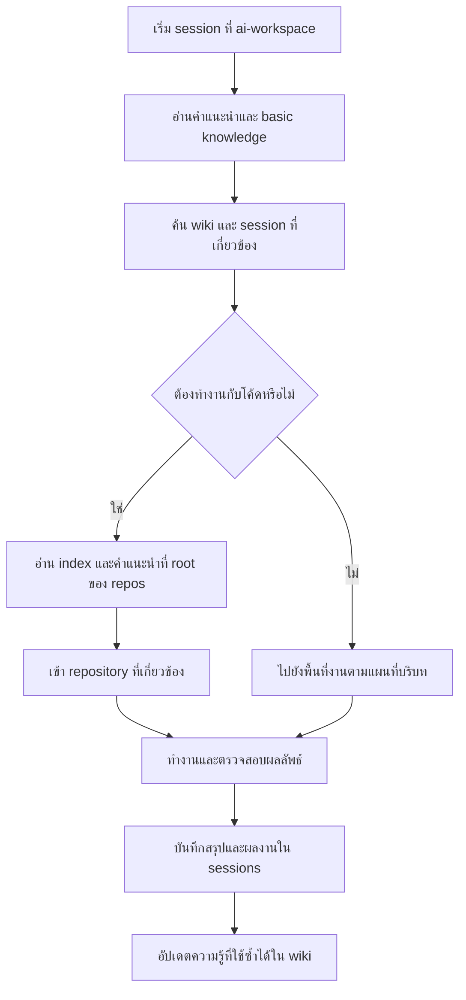

เวลาทำงานกับ AI สิ่งที่ผมอยากได้คือ workspace เดียวที่ใช้เป็นจุดเริ่มต้นของทุกงาน บริบทจากงานก่อนหน้าสามารถนำมาใช้ต่อได้ และทั้งประวัติการคุย โค้ด สคริปต์ รวมถึงโน้ตต่าง ๆ ยังกลับมาดูหรือค้นหาได้เมื่อจำเป็น

แนวคิดนี้ทำให้ผมออกแบบโฟลเดอร์ชื่อ `ai-workspace` ขึ้นมา เพื่อจัดระเบียบการทำงานร่วมกับ agent ให้เข้ากับวิธีทำงานของผมเอง

สิ่งที่ผมสนใจคือการจัดการ context รอบตัว AI: จะให้ agent เริ่มต้นอ่านอะไร รู้ได้อย่างไรว่างานอยู่ตรงไหน และเมื่อทำงานเสร็จแล้ว ความรู้ที่ได้ควรถูกเก็บไว้ที่ใด เพื่อให้ session ถัดไปหยิบมาใช้ได้

## Workspace เดียวเป็นจุดเริ่มต้นของทุกงาน

คำว่า workspace เดียวในที่นี้หมายถึงจุดเริ่มต้นในการทำงาน ทุก session ของผมเริ่มจาก `ai-workspace` แล้ว agent ค่อยตาม path และคำแนะนำที่เตรียมไว้ไปยังพื้นที่ที่เกี่ยวข้อง

ตัว repository ของโค้ดอยู่ในอีกโฟลเดอร์หนึ่งชื่อ `repos` ซึ่งแยกออกจาก `ai-workspace` ส่วน index ของ repository และไฟล์อธิบายว่าแต่ละ repo ใช้ทำอะไรจะอยู่ที่ root ของ `repos` เอง

ใน `ai-workspace` จึงต้องรู้ว่าโค้ดอยู่ที่ path ไหน และจะไปอ่าน index ได้จากที่ไหน เมื่อได้รับงาน agent ก็สามารถใช้ข้อมูลเหล่านี้เป็นจุดเริ่มต้นในการค้นหาบริบทที่ต้องใช้

## โครงสร้างที่ผมใช้จัดระเบียบการทำงาน

ภาพรวมของโครงสร้างเป็นแบบนี้ โดยชื่อไฟล์ Markdown และชื่อโฟลเดอร์ย่อยในตัวอย่างใช้เพื่ออธิบายหน้าที่ สามารถปรับให้ตรงกับ harness ที่ใช้งานได้

```text
working-directory/
├── ai-workspace/
│   ├── AGENTS.md
│   ├── sessions/
│   │   └── <หนึ่งหัวข้อหรือหนึ่งงาน>/
│   │       ├── summary.md
│   │       ├── notes.md
│   │       └── scripts/
│   └── wiki/
│       └── <ความรู้และแนวทางที่ใช้ซ้ำได้>.md
└── repos/
    ├── INDEX.md
    ├── AGENTS.md
    └── <GitLab group>/
        └── <subgroup>/
            └── <repository>/
```

โครงสร้างนี้แบ่งข้อมูลตามหน้าที่: `sessions` เก็บเรื่องราวของแต่ละงาน `wiki` เก็บความรู้ที่นำไปใช้ต่อได้ และไฟล์คำแนะนำของ agent ทำหน้าที่เป็นแผนที่สำหรับเริ่มต้นค้นหา

### Sessions: หนึ่ง session เท่ากับหนึ่งหัวข้อหรืองาน

ผมใช้ `sessions` เก็บสิ่งที่เกิดขึ้นระหว่างการทำงานกับ AI โดยให้หนึ่ง session ผูกกับหนึ่งหัวข้อหรืองานที่คุยกัน

ภายในนั้นสามารถมีทั้งสรุปบทสนทนา โน้ต โค้ดทดลอง สคริปต์ และผลลัพธ์ที่เกี่ยวข้องกับงานนั้น การเก็บของเหล่านี้ไว้ด้วยกันช่วยให้กลับมาอ่านแล้วเข้าใจได้ว่า ตอนนั้นกำลังแก้ปัญหาอะไร ลองอะไรไปบ้าง และจบลงตรงไหน

สำหรับงานที่ยังไม่เสร็จ สรุปของ session ควรช่วยตอบได้ว่าเรารู้อะไรแล้ว ยังไม่รู้อะไร และขั้นตอนถัดไปคืออะไร ข้อมูลนี้เป็นบริบทสำหรับกลับมาทำต่อ โดยไม่ต้องเริ่มอธิบายงานใหม่ทั้งหมด

อย่างไรก็ตาม การมีโฟลเดอร์ `sessions` ไม่ได้ทำให้ประวัติจากทุกเครื่องมือถูกบันทึกเองอัตโนมัติ ต้องกำหนดให้ harness หรือ agent บันทึกข้อมูลลงในพื้นที่นี้ด้วย ถ้าต้องการเก็บบทสนทนาฉบับเต็ม ก็ควรมีขั้นตอนบันทึกหรือ export แยกจากไฟล์สรุป เพราะสรุปกับประวัติเต็มมีรายละเอียดไม่เท่ากัน

### Wiki: พื้นที่ของ agent สำหรับสะสมความรู้

`wiki` เป็นพื้นที่ที่ผมให้ agent ดูแลได้เต็มที่ เพื่อจดสิ่งที่ค้นพบจากงานที่ผ่านมา โดยเฉพาะ golden results และ golden paths ที่มีโอกาสนำกลับมาใช้ซ้ำ

ในบริบทนี้ golden result คือผลลัพธ์ที่ตรวจสอบแล้วว่าใช้ได้ ส่วน golden path คือแนวทางที่เคยทำสำเร็จ พร้อมเงื่อนไขที่ทำให้แนวทางนั้นใช้ได้ ตัวอย่างเช่น ลำดับการตรวจสอบปัญหา หรือวิธีแก้ไขที่ผ่านการยืนยันในสภาพแวดล้อมหนึ่งแล้ว

ความต่างจาก `sessions` คือ session บอกเรื่องราวของงานหนึ่งชิ้น ขณะที่ wiki ดึงความรู้จากงานนั้นมาเรียบเรียงให้ใช้กับงานอื่นได้ ครั้งต่อไปที่เจอปัญหาคล้ายกัน agent จึงมีจุดเริ่มต้นที่ชัดเจนขึ้น

เพื่อให้ความรู้เหล่านี้ใช้งานต่อได้ดี สิ่งที่ควรบันทึกคู่กันคืออาการของปัญหา บริบท วิธีที่ตรวจสอบ ผลลัพธ์ และลิงก์กลับไปยัง session ต้นทาง วิธีที่ใช้ได้กับ cluster หรือเวอร์ชันหนึ่งอาจใช้ไม่ได้กับอีกระบบ การเก็บเงื่อนไขไว้ด้วยจึงช่วยให้ agent ตัดสินใจได้ว่าควรนำมาใช้ตรง ๆ หรือจำเป็นต้องตรวจสอบใหม่

### Basic knowledge: แผนที่ที่ agent ต้องรู้ก่อนเริ่มงาน

อีกส่วนหนึ่งคือความรู้พื้นฐานในไฟล์ Markdown ที่ harness ใช้เป็นคำแนะนำให้ agent เช่น `AGENTS.md` ในตัวอย่าง

ข้อมูลในส่วนนี้ช่วยอธิบายพื้นที่ที่ผมต้องดูแล เช่น Kubernetes มีกี่ cluster แต่ละ cluster มีหน้าที่อะไร AWS accounts ที่เกี่ยวข้องมีอะไรบ้าง แต่ละ account ใช้ทำอะไร และถ้าต้องการตรวจสอบปัญหาประเภทหนึ่งควรเริ่มไปหาที่ไหน

สำหรับโค้ด ไฟล์นี้จะชี้ไปยัง path ของ `repos` และตำแหน่ง index ที่ต้องอ่าน ส่วนรายละเอียดของ repository จะอยู่ใน `repos` เอง แทนที่จะต้องคัดลอกแผนที่ repository ทั้งหมดมาเก็บซ้ำใน workspace

ผมมอง basic knowledge เป็นข้อมูลสำหรับนำทาง และมอง wiki เป็นความรู้จากการลงมือทำ ทั้งสองส่วนช่วยกันทำให้ agent รู้ว่าจะไปที่ไหนก่อน และเมื่อไปถึงแล้ว มีบทเรียนอะไรที่ควรใช้ประกอบการทำงาน

### Repos: จัดโครงสร้างให้ตรงกับ GitLab

ใน `repos` ผมจัดโฟลเดอร์ให้ตรงกับโครงสร้างบน GitLab ทั้ง group, subgroup และ repository เพื่อให้ตำแหน่งบนเครื่องสอดคล้องกับที่อยู่ของโค้ดที่ใช้งานจริง

ที่ root ของ `repos` จะมี index และไฟล์ Markdown อธิบายว่าอะไรอยู่ตรงไหน แต่ละ repository มีหน้าที่อะไร เมื่อ agent ตาม path มาจาก `ai-workspace` ก็ต้องอ่านแผนที่ส่วนนี้ก่อนเลือกเข้าไปทำงานใน repo ที่เกี่ยวข้อง

การแบ่งแบบนี้ทำให้ข้อมูลอยู่ใกล้กับสิ่งที่อธิบาย: แผนที่โค้ดอยู่กับพื้นที่เก็บโค้ด ส่วนประวัติการทำงานและความรู้ที่เกิดจากการใช้ AI อยู่ใน `ai-workspace`

## จากเริ่ม session ไปจนถึงเก็บความรู้กลับเข้า wiki

workflow ที่ผมออกแบบไว้เริ่มจากการเปิด session ที่ `ai-workspace` ให้ agent อ่านคำแนะนำพื้นฐาน แล้วค้นหาบริบทที่เกี่ยวข้องกับงาน หากต้องทำงานกับโค้ดก็ไปอ่าน index ใน `repos` ก่อนเข้า repository เป้าหมาย หากเป็นงานเกี่ยวกับ infrastructure ก็ใช้แผนที่ cluster หรือ account เพื่อเลือกพื้นที่ที่ต้องตรวจสอบ



ระหว่างทำงาน สิ่งที่ทดลองและผลที่ได้จะถูกเก็บไว้กับ session นั้น เมื่อได้แนวทางที่ตรวจสอบแล้วและน่าจะมีประโยชน์ในอนาคต agent จึงนำไปอัปเดตใน wiki พร้อมบริบทและที่มา

เป้าหมายคือให้ session ถัดไปสามารถอ่านความรู้ที่สะสมไว้ แล้วเลือกข้อมูลที่เกี่ยวข้องเข้ามาใช้ ไม่จำเป็นต้องโหลดทุกไฟล์หรือประวัติทั้งหมดเข้า context พร้อมกัน ไฟล์คำแนะนำและ index จึงสำคัญ เพราะช่วยให้ค้นหาสิ่งที่ต้องใช้ได้เป็นลำดับ

## ความต่อเนื่องเกิดจากการอ่านและบันทึก

หัวใจของระบบนี้คือการทำให้การอ่านบริบทและการบันทึกผลลัพธ์เป็นส่วนหนึ่งของวิธีทำงานกับ agent โฟลเดอร์เป็นที่เก็บข้อมูล ส่วน harness และคำแนะนำเป็นตัวกำหนดว่า agent จะใช้ข้อมูลเหล่านั้นอย่างไร

ความรู้ที่เก็บไว้ในไฟล์ไม่ได้หมายความว่าโมเดลได้รับการฝึกเพิ่มหรือจำทุกอย่างได้เอง แต่เป็นบริบทภายนอกที่ agent สามารถกลับมาอ่านและปรับปรุงได้ ความต่อเนื่องจึงขึ้นอยู่กับการบันทึกที่ครบพอ และการค้นข้อมูลที่เหมาะกับงาน

สิ่งที่ผมต้องการจาก `ai-workspace` คือทุกครั้งที่กลับมาเริ่มงาน ผมกับ agent มีจุดตั้งต้นร่วมกัน รู้ว่าบริบทอยู่ที่ไหน งานที่ผ่านมาเก็บไว้อย่างไร และบทเรียนไหนสามารถช่วยงานตรงหน้าได้ เมื่อเจอปัญหาเดิมอีกครั้ง ความรู้จากครั้งก่อนก็ยังมีที่ให้กลับไปหา
